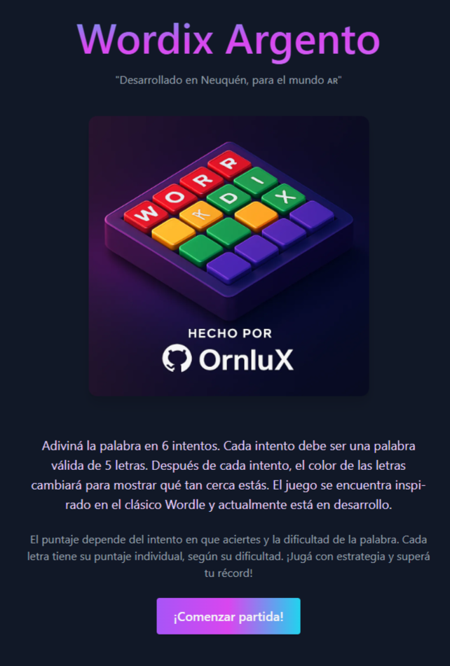
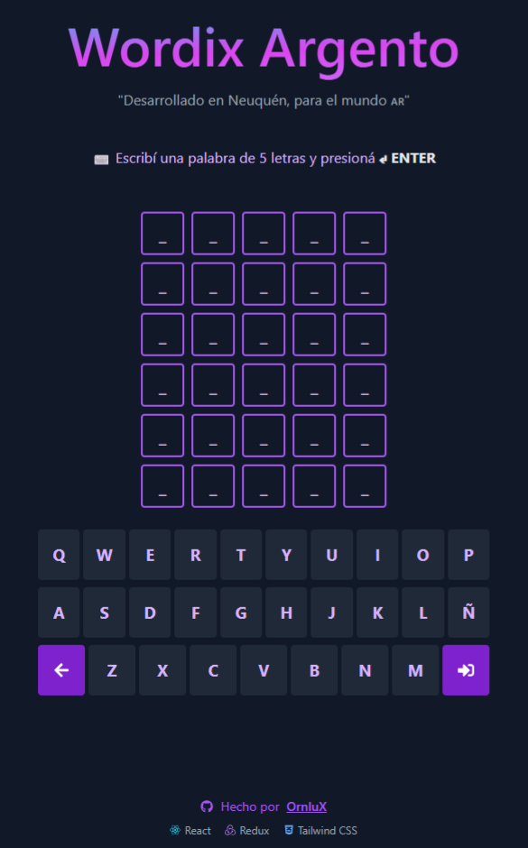

# 🎮 Wordix Web


---
🚀 **Sitio desplegado:**  
👉 [https://ornlux.github.io/wordix-web/](https://ornlux.github.io/wordix-web/)

---
## 🧩 Descripción

**Wordix Web** es un juego web inspirado en el clásico Wordle. Desarrollado con React + Redux, permite adivinar palabras en 6 intentos, ofrece puntajes dinámicos basados en dificultad y muestra animaciones al ganar o perder.  
Incluye un modal para que el jugador ingrese su nombre, persistencia de estado con Redux Persist, y próximamente mostrará estadísticas y logros.

> ✍️ _“Desarrollado en Neuquén, para el mundo AR”_

---

## 📸 Capturas

| Pantalla de bienvenida | Pantalla de juego |
|------------------------|-------------------|
|  |  |

---

## 📂 Estructura del proyecto

```txt
wordix-web/
├── public/
├── src/
│   ├── assets/               # Imágenes, estilos
│   ├── components/           # Componentes reutilizables
│   ├── data/                 # Palabras del juego (JSON)
│   ├── pages/                # Vistas como Game y Welcome
│   ├── store/                # Redux slices, configuración y persistencia
│   ├── App.jsx               # Rutas principales
│   ├── main.jsx              # Entrada de la app
│   └── index.css             # Tailwind + estilos base
├── .gitignore
├── README.md
├── package.json
└── vite.config.js
```

---

## ⚙️ Requisitos

- Node.js 18 o superior
- npm, pnpm o yarn
- Navegador moderno

---

## 🚀 Instalación y ejecución

```bash
# 1. Clonar el repositorio
git clone https://github.com/tuusuario/wordix-web.git

# 2. Ingresar al proyecto
cd wordix-web

# 3. Instalar dependencias
npm install

# 4. Ejecutar en modo desarrollo
npm run dev
```

---

## 🎮 Características principales

- Adiviná palabras en 6 intentos
- Puntaje según dificultad de letras y número de intento
- Nombre de jugador con persistencia local
- Animaciones (flip, shake, confetti)
- Diseño responsive con Tailwind CSS
- Arquitectura escalable con Redux Toolkit
- Preparado para agregar logros y estadísticas

---

## 🔐 Buenas prácticas aplicadas

- Componentes reutilizables
- Separación clara entre lógica y presentación
- Redux Persist para mantener estado entre recargas
- Rutas protegidas y navegación controlada

---

## 👨‍💻 Autor

Proyecto creado por **OrnluX**

[🔗 GitHub](https://github.com/OrnluX)

---

## 🧾 Licencia

Este proyecto está licenciado bajo la [MIT License](LICENSE).

---

¡Gracias por jugar a Wordix Argento! 🇦🇷✨
